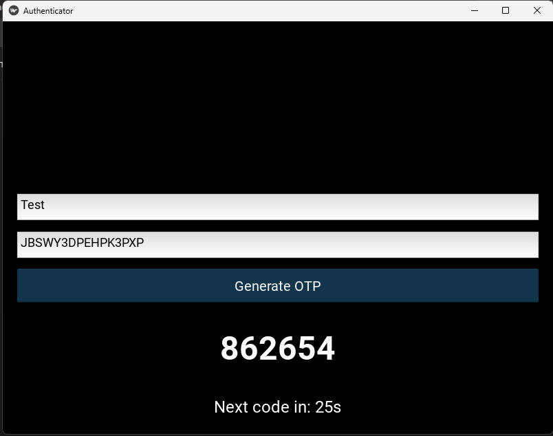

# 🔐 Authenticator
A simple TOTP (Time-based One-Time Password) authenticator app built with Python and Kivy for generating secure 2-factor authentication (2FA) codes locally on your computer.
This application allows you to generate login verification codes (for services like GitHub, Google, and others) without relying on a mobile device.

---

**✨ Features**
- 🔐 Generate TOTP codes for 2FA-enabled accounts
- 🗃️ Store secrets locally on the device
- ⚡ Automatic OTP refresh every 30 seconds
- 🖥️ Cross-platform desktop application
- 🐍 Built using Python and Kivy
- 💾 Remembers previously added services

---

**📸 Screenshot**



---

**📦 Requirements**
- Python 3.11 (recommended for Kivy compatibility)
- pip (Python package manager)

> ⚠️ Newer Python versions (3.13/3.14) may not yet fully support Kivy.

---

**🚀 Installation**

1. Clone the repository
```bash
git clone https://github.com/mosesamwoma/authenticator.git
```

2. Navigate into the project directory
```bash
cd authenticator
```

3. Install dependencies
```bash
pip install -r requirements.txt
```

---

**▶️ Usage**

Run the application:
```bash
python auntenticator.py
```

**Steps**
1. Enter a service name (e.g., GitHub, Google)
2. Paste your TOTP secret key (Base32 format)
3. Click Generate OTP
4. A new authentication code will appear and refresh every 30 seconds

---

**💻 Desktop App (Windows)**

Prefer not to set up Python? Download the ready-to-run Windows executable directly:

[⬇️ Download Authenticator.exe](https://github.com/mosesamwoma/authenticator/releases/download/untagged-17b79d5d300c9a85a32b/Authenticator.exe)

Just download and run — no Python installation required!

---

**⚙️ How It Works**

TOTP (Time-based One-Time Password) generates temporary authentication codes using:
- A shared secret key
- The current system time

Each code:
- Expires every 30 seconds
- Can only be used once
- Adds an extra layer of account security

The app uses the `pyotp` library to implement the TOTP standard (RFC 6238).

---

**🔒 Security Note**

Secrets are stored locally in a JSON file on your device. They are not uploaded or shared externally.

> Future improvements may include encryption for enhanced protection.

---

**🛠️ Built With**
- [Python](https://www.python.org/)
- [Kivy](https://kivy.org/)
- [PyOTP](https://pyauth.github.io/pyotp/)

---

**🔮 Future Improvements**

Here's what's planned for upcoming versions of the Authenticator app:

| # | Improvement | Description |
|---|-------------|-------------|
| 1 | 🔑 **Encrypt stored secrets** | Secure local secrets with encryption instead of plain JSON |
| 2 | 🔒 **App lock / PIN** | Require a PIN or password to open the app |
| 3 | 📊 **Multi-account dashboard** | View and manage all accounts from a single screen |
| 4 | 📋 **Copy OTP button** | One-click copy of the generated code to clipboard |
| 5 | 📷 **QR code scanning** | Scan QR codes to automatically import account secrets |
| 6 | ✏️ **Edit/Delete accounts** | Modify or remove saved accounts easily |
| 7 | ⏳ **Countdown progress bar** | Visual timer showing time remaining before OTP expires |
| 8 | 🌙 **Dark mode UI** | Toggle between light and dark themes |
| 9 | 🖼️ **Service icons/logos** | Display recognisable icons for each added service |
| 10 | 📦 **Create installer (.exe setup)** | A proper Windows installer for easier distribution |
| 11 | 🔄 **Auto-update system** | Automatically check for and apply app updates |
| 12 | 💾 **Backup & restore accounts** | Export and import accounts for safekeeping |
| 13 | 🔐 **Master password unlock** | Protect all accounts behind a single master password |
| 14 | 🌐 **Chrome extension version** | Access OTP codes directly from the browser |
| 15 | 📱 **Mobile phone app (Android/iOS)** | A native mobile version of the authenticator |
| 16 | ⚙️ **Auto-build releases (GitHub Actions)** | Automate builds and releases using CI/CD pipelines |

---

**🙌 Contributions**

Contributions, suggestions, and improvements are welcome!
Feel free to fork the repository and submit a pull request.

---

**⭐ Support**

If you find this project useful, consider giving it a ⭐ on GitHub!
